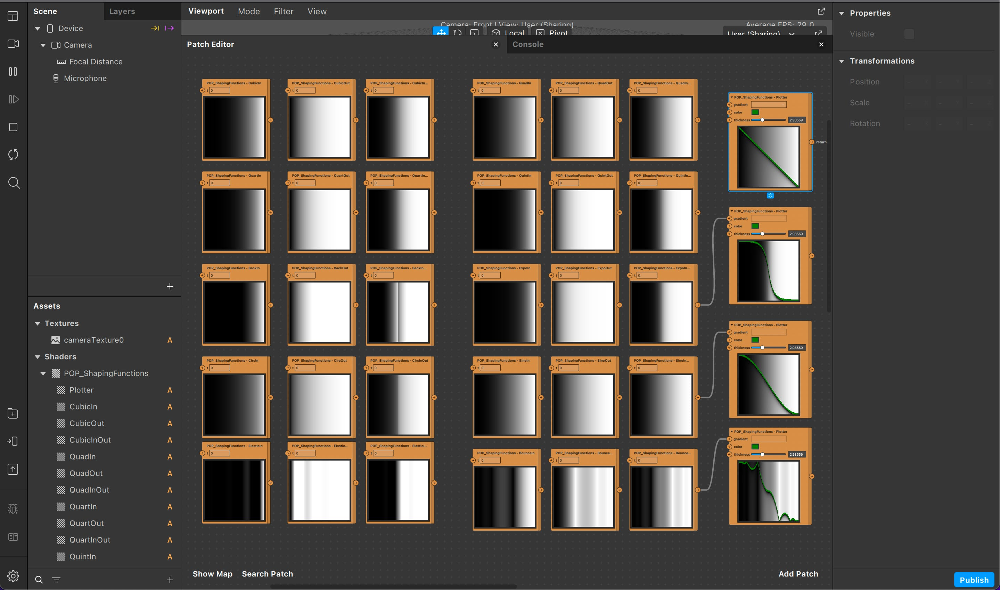

## Shaping Functions in Spark AR

This project features a collection of shaping functions by Robert Penner, and a curve plotter (used for visualizing curves). It's a great tool to have in shader development!

The curve plotter is ported from the unparalleled ["Book of Shaders" by Patricio Gonzalez Vivo & Jen Lowe](https://thebookofshaders.com/). Check out their page on [shaping functions](https://thebookofshaders.com/05/) to learn more!
